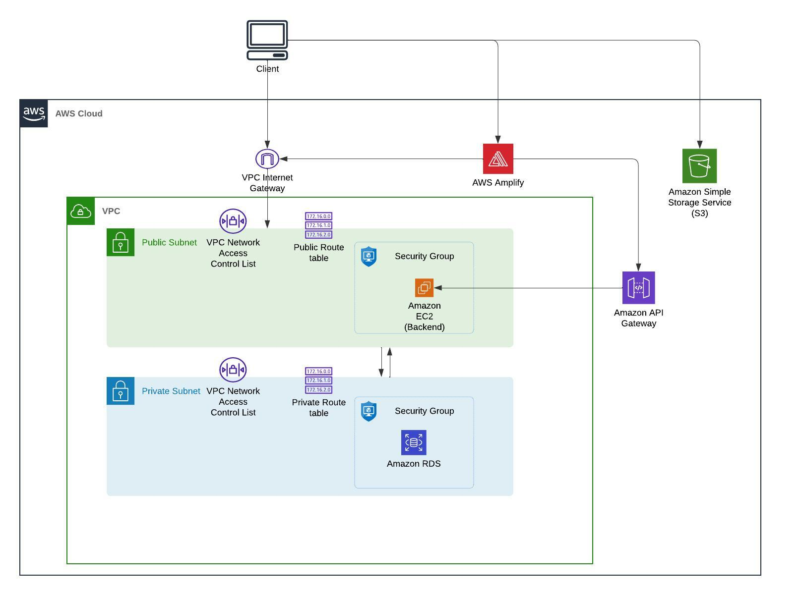

# Full Stack Inventory Management Dashboard Application

## Overview

This project is focused on **building and deploying** a complete **full-stack Inventory Management Dashboard application** that leverages modern technologies for both frontend and backend development. The key components of the application include:

- **Frontend**: Developed using **Next.js**, styled with **Tailwind CSS**, and utilizes **Material UI Data Grid** for handling and visualizing complex datasets.
- **State Management**: Handled with **Redux Toolkit** for a simplified global state management solution, enhanced by **Redux Toolkit Query** for efficient data fetching.
- **Backend**: Powered by **Node.js** with **Prisma ORM** facilitating smooth database operations and handling interactions between the application and the database.
- **Cloud Deployment**: Integrated with various **AWS** services such as **RDS** for database management, **EC2** for hosting backend services, **API Gateway** for managing API endpoints, **Amplify** for frontend deployment, and **S3** for secure file storage.

This approach outlines how to build a robust, scalable, and maintainable full-stack application architecture capable of handling large datasets and ensuring smooth interaction between different system components.

---

## Frontend

### 1. Next.js
The frontend is built using **Next.js**, a powerful React-based framework. Next.js provides features like **server-side rendering (SSR)** and **static site generation (SSG)**, which boost the performance of the application, especially when dealing with real-time data and large datasets. These features help deliver a fast and responsive user experience, which is critical for an inventory management dashboard.

### 2. Tailwind CSS
For the styling, **Tailwind CSS** is used. Tailwind offers a **utility-first** approach, allowing the creation of custom, responsive designs quickly and efficiently. With Tailwind, the user interface can be easily adapted to different screen sizes, ensuring the dashboard looks polished on mobile devices, tablets, and desktops.

### 3. Material UI Data Grid
**Material UI Data Grid** is implemented to display and manage inventory data. It is a robust table component that supports features like **sorting**, **filtering**, and **pagination**, making it ideal for handling large and complex datasets. This component enhances the ability to visualize the data stored in the inventory, enabling users to interact with the data easily.

---

## State Management

### 1. Redux Toolkit
State management is streamlined using **Redux Toolkit**, a more concise and efficient version of the Redux library. It eliminates the need for boilerplate code and offers built-in tools that simplify the process of managing global state. In this application, Redux is responsible for managing inventory data, user preferences, and application state across various components.

### 2. Redux Toolkit Query (RTK Query)
For data fetching, **Redux Toolkit Query (RTK Query)** is used. This helps to manage **API requests**, automatically handles caching, and reduces the complexity of managing side effects in the application. By using RTK Query, the application can efficiently fetch and synchronize data between the frontend and the backend.

---

## Backend

### 1. Node.js and Prisma ORM
The backend logic is developed using **Node.js**, a JavaScript runtime that enables fast and scalable server-side programming. The backend handles all the business logic, including authentication, CRUD operations for inventory items, and API endpoints for the frontend.

**Prisma ORM** is used to manage interactions with the database. Prisma provides a type-safe, easy-to-use query interface, simplifying database operations. It abstracts away complex SQL queries, allowing for **automatic database migrations**, efficient data management, and smoother development workflows. Prisma supports multiple databases, such as PostgreSQL, MySQL, and SQLite, making it versatile for production or development environments.

---

## AWS Cloud Services

The application is designed to be **cloud-native**, taking advantage of **Amazon Web Services (AWS)** for scalability and cost-efficient management of resources. AWS services play a key role in hosting and managing both the backend and frontend of the application.

Here is the architecture diagram showing how different AWS services are integrated into the application:

Figure: Overview of the AWS architecture used in this project.

### 1. AWS RDS (Relational Database Service)
**AWS RDS** is used to host the application’s relational database. It provides a managed service for databases like **PostgreSQL** or **MySQL**, ensuring **high availability** and **scalability** without the need for manual database management. AWS RDS takes care of backups, updates, and scaling automatically, allowing the application to handle large amounts of inventory data efficiently.

### 2. AWS EC2 (Elastic Compute Cloud)
The backend server is deployed on **AWS EC2 instances**, which provide virtual computing environments in the cloud. EC2 allows you to **scale** the application up or down based on traffic and usage, ensuring that the backend can handle the required workloads. The instances can be configured for **security**, **performance optimization**, and **cost management**.

### 3. AWS API Gateway
To manage and secure the API endpoints, **AWS API Gateway** is used. API Gateway provides features like **throttling**, **authentication**, and **monitoring**, ensuring that the APIs used by the frontend are secure and reliable. It also helps with routing and scaling the API requests made by the inventory dashboard.

### 4. AWS Amplify
The frontend is deployed using **AWS Amplify**, which provides a seamless platform for deploying and managing frontend applications. Amplify simplifies the **continuous integration and deployment (CI/CD)** process, ensuring that updates to the frontend are deployed automatically whenever new code is pushed to the repository. It is optimized for static site hosting and offers various features like custom domain management and security configurations.

### 5. AWS S3 (Simple Storage Service)
To handle file storage, **AWS S3** is integrated into the application. S3 is used for storing **static assets** like images, documents, and inventory-related files. S3 provides secure, scalable, and durable storage, with **access control** policies to ensure that files are only accessible to authorized users. S3’s integration into the inventory system allows for seamless file uploads, downloads, and storage management.

---

## Key Features and Takeaways

Through this project, you will understand how to:

- Build a **full-stack application** using modern technologies such as Next.js, Node.js, and Prisma.
- Implement effective **state management** with Redux Toolkit.
- Deploy a backend that interacts with a database through **Prisma ORM**.
- Integrate and manage **AWS services** such as RDS, EC2, API Gateway, and S3 for cloud storage and computing.
- Deploy a frontend using **AWS Amplify** for easy CI/CD and scalability.
- **Monitor costs** and manage cloud infrastructure effectively to maintain a cost-efficient and scalable application.

This project combines modern web development practices with cloud computing, providing a complete solution for building and deploying full-stack applications in a scalable manner.